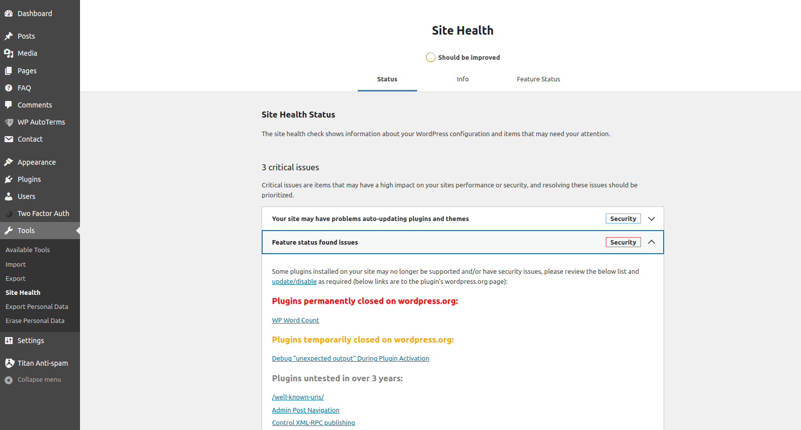

# Feature Status Check #
**Contributors:** [gregross](https://profiles.wordpress.org/gregross/)  
**Feature URI:** http://toolstack.com/feature-status-check  
**Author URI:** http://toolstack.com  
**Tags:** admin plugins status  
**Requires at least:** 5.2  
**Tested up to:** 6.1.1  
**Requires PHP:** 7.0  
**Stable tag:** 1.0  
**License:** GPLv2  

Checks to see if the plugins you have on your site are still supported in the plugin directory.

## Description ##

Feature status can be a hard thing to manage in your WordPress installation, sometimes plugins get abandoned, or closed for security reasons and you have no way of knowing without visiting the plugin page.

Feature Status Check gives you a unified dashboard to view the status of all your installed plugins, and highlights those that might have issues.

Feature Status Check also integrates with the WordPress site Health feature and highlights those plugins with possible issues.

Finally, Feature Status Check also send out a change report to the site admin during the daily update via e-mail.

This code is released under the GPL v2, see license.txt for details.

## Installation ##

1. Extract the archive file into your plugins directory in the feature-status-check folder.
2. Activate the plugin in the Feature options.
3. Done!

## Frequently Asked Questions ##

### Ok, I've activated it... now what? ###

Feature Status Check has three pages you can visit:

1. The main plugin page can be found in the WordPress admin under Features, titled "Status Check".
2. It integrates with the Site Health page which can be found in the WordPress admin under Tools, Site Health.  Feature Status Check will add notices to the Status tab for issues it finds, as well as adding a new tab call "Feature Status" that you can view the complete details on.
3. The settings page can be found in the WordPress admin under Settingss, titled "Feature Status Check".

### The plugin page seems to freeze for a long time when I manually update the data, what's going on? ###

If you have a large number of plugins installed on your site, each one must be checked against wordpress.org, this can take a significant amount of time.

By default, Feature Status Check sets up a daily cron job to cache this data so you should never see this, but if there is a problem with cron, or you want to manually update the data then this may take a while to load while this data is retrieved.

### What do the different status' mean? ###

* **Not Found** means the plugin does not exist in the wordpress.org plugin directory.  You'll have to manually check it from where you installed the plugin from.
* **Out of Date** means there is a new version of the plugin ready to install.
* **Up to Date** means that the plugin has been tested within the last three years and the current version is installed.
* **Un-Tested** means that the plugin has not been tested with WordPress or updated in 3 years or more.
* **Temporarily Closed** means the plugin is temporarily available for download from the wordpress.org plugin directory.  This is often due to a security issue or a violation of the community standards.  How long the plugin will remain in this state has a couple of factors to it, but in general no longer than 60 days.
* **Closed** means the plugin is permanently closed.

## Screenshots ##

### 1. Feature Status Check screen. ###

### 2. WordPress Site Health integration ###

### 3. Settings page. ###

## Changelog ##

### 1.0 ###

* Release date: TBD
* Initial release.

## Upgrade Notice ##

None at this time.

## Roadmap ##

* None at this time!
